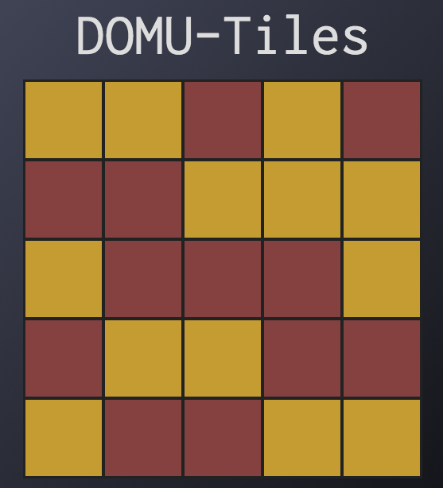

# DOMU-Tiles

DOMU-Tiles is a simple demonstration of [DOMU](https://github.com/hanhee-song/DOMU), a JavaScript library that streamlines DOM interactions.

### How to play

Click on a tile to flip the tile and all tiles that share an edge. Make all tiles one color to win!
